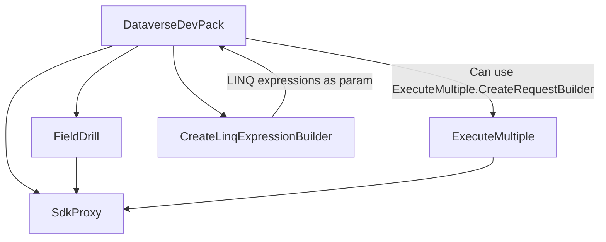

# DevPack4Dataverse

DevPack4Dataverse aka DevPack For Dataverse is a set of instructions built on top of the SDK for Dataverse. Designed with the idea of optimizing and speeding up work with external communication with Dataverse API.
## License

[Apache License 2.0](https://github.com/C485/DevPack4Dataverse/blob/master/LICENSE.md)


# Features



### ExecuteMultiple
Gives ability to quickly call dataverse endpoint with optimized packs of requests, multiple connections will be used to multiply speed and skip request per minute limits. In example bellow you can see how you can build unlimited in size requests that later will be sent to datavserse endpoint in packs.
```C# 
 Entity[] recordsInCrm = dataverseDevPack.SdkProxy.RetrieveMultiple(new QueryExpression
 {
     EntityName = EntityName,
     ColumnSet = new ColumnSet(false)
 });
 ExecuteMultipleRequestBuilder executeMultipleRequestBuilder = dataverseDevPack.ExecuteMultiple
     .CreateRequestBuilder();
 foreach (var item in recordsInCrm)
 {
     executeMultipleRequestBuilder.AddDelete(item.ToEntityReference());
 }
 AdvancedExecuteMultipleRequestsStatistics executeStatistic = await dataverseDevPack.ExecuteMultiple
     .Execute(executeMultipleRequestBuilder,
	     new ExecuteMultipleRequestSettings
	     {
	         ErrorReport = (OrganizationRequest obj, string error) => Console.WriteLine($"Error: {error}"),
	         ReportProgress = (int cur, int max) => Console.Title = $"Progress[{cur}/{max}]",
	         ReportProgressInterval = TimeSpan.FromMilliseconds(100)
	     });
```
                
### FieldDrill
Gives ability to go down by lookup fields simply by defining path as string with specified delimiter or by providing path as array of fields.
For example when we have lookup that points to record X, we can call FieldDrill with these parameters
`await dataverseDevPack.FieldDrill.RetreiveAsync<string>(item.ToEntityReference(), "ownerid.fullname");`
It will retrieve field fullname from lookup named ownerid in starting record entity reference.
### SdkProxy
Gives ability to quickly execute any type of request to dataverse endpoint. 
### CreateLinqExpressionBuilder
Gives ability to build expression that later can be used in Where method of early or late bound in OrganizationServiceContext class. In this example we'll try to retrieve 100 records by name. Maximum limit of expressions is 500, it's hard limit specified by SDK. 
```C#
 ILinqExpressionBuilder<Entity> builder = connectionManager.CreateLinqExpressionBuilder<Entity>();
 foreach (string item in Enumerable.Range(1, 100).Select(p => $"Name {p}"))
 {
     builder.AddOr(p => p["xx_name"] == item);
 }
 Expression<Func<Entity, bool>> finalExpression = builder.Result;
 serviceContext.xxSet.Where(finalExpression).ToArray();
```


## Roadmap

- Add model to model mapper for integration
- QueryBuilder for faster and better requests / also for LINQ
- LINQ support
- and more...